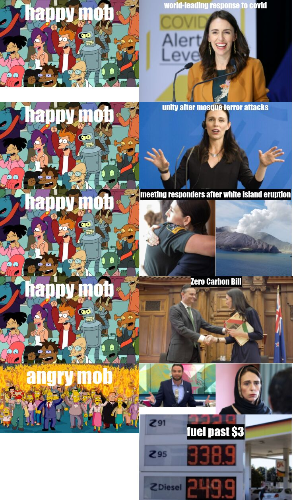

## **Greetings traveler!** 👋

### **WELCOME TO MY MEME**

#### **The motive**
The *motivation* behind creating this meme was to portray how the popularity of a famous person can plummet with just one event. Although the person might have done many other good deeds, it often seems like the general public is mostly fixated on the one odd event that the crowd doesn't agree with. In this case, although fuel prices were a global issue, many New Zealanders held the prime minister accountable for it. 

##### **Is this meme funny though?**
The meme features images from the following links to their respective websites:
  - An image of [*Ryan Bridge*](https://www.magic.co.nz/home/archivedtalk/on-demand/the-am-show/2018/10/jacinda-ardern-s-petrol-price-crusade-a--hypocrisy--ryan-bridge-/_jcr_content/image.dynimg.1280.q75.jpg/v1540420153517/amshow-ryan-bridge-1120.jpg) who almost made Jacinda struggle for words when questioning about rising fuel prices
  - An image from Futurama of a [*happy mob*](https://static1.moviewebimages.com/wordpress/wp-content/uploads/2022/02/Futurama-Bender-Cheers.jpg)
  - An image from The Simpsons of an [*angry mob*](https://a57.foxnews.com/static.foxnews.com/foxnews.com/content/uploads/2018/09/1024/512/Springfield-Angry-Mob.jpg?ve=1&tl=1)
  - An image of a [*sad Jacinda*](https://www.abc.net.au/news/image/10929894-3x2-940x627.jpg)
  - An image of [*fuel price*](https://www.newstalkzb.co.nz/media/1mpfbtfz/petrol-prices-in-auckland.jpg?mode=crop&rnd=132917444785170000&height=379&width=675&quality=80&scale=both) at Z energy NZ
  - Different images of a happy Jacinda
    - [*happy Jacinda1*](https://api.time.com/wp-content/uploads/2020/06/GettyImages-1248074439.jpg?w,800,quality,85)
    - [*happy Jacinda2*](https://img.republicworld.com/republic-prod/stories/promolarge/xhdpi/tgkh0hyrzzka6cec_1636795694.jpeg)
    - [*happy Jacinda3*](https://www.newshub.co.nz/dam/form-uploaded-images-ordered/2019/12/14/supplied-ardern-white-island-1120.jpg)
    - [*happy Jacinda4*](https://resources.stuff.co.nz/content/dam/images/1/m/i/6/h/6/image.related.StuffLandscapeSixteenByNine.1420x800.1nig3u.png/1513632349476.jpg)

##### **Some functions used in the creation of this meme:**
 - `image_read()`
 - `image_annotate()`
 - `image_append()`
 - `image_scale()`
    



```{r}
output:
  code_folding: hide
library(magick)

happy_jacinda <- image_read("https://api.time.com/wp-content/uploads/2020/06/GettyImages-1248074439.jpg?w,800,quality,85") %>%
  image_scale(300)
happy_jacinda <- image_scale(image_scale(happy_jacinda,"100%"),"128%")
happy_jacinda <- image_annotate(happy_jacinda,
                            text = "world-leading response to covid",
                            color = "#ffffff",
                            size = 20,
                            font = "Impact",
                            gravity = "north")

happy_jacinda2 <- image_read("https://img.republicworld.com/republic-prod/stories/promolarge/xhdpi/tgkh0hyrzzka6cec_1636795694.jpeg") %>%
  image_scale(300)
happy_jacinda2 <- image_scale(image_scale(happy_jacinda2,"100%"),"128%")
happy_jacinda2 <- image_annotate(happy_jacinda2,
                                text = "unity after mosque terror attacks",
                                color = "#ffffff",
                                size = 20,
                                font = "Impact",
                                gravity = "north")

happy_jacinda3 <- image_read("https://www.newshub.co.nz/dam/form-uploaded-images-ordered/2019/12/14/supplied-ardern-white-island-1120.jpg") %>%
  image_scale(300)
happy_jacinda3 <- image_scale(image_scale(happy_jacinda3,"100%"),"128%")
happy_jacinda3 <- image_annotate(happy_jacinda3,
                                 text = "meeting responders after white island eruption",
                                 color = "#ffffff",
                                 size = 20,
                                 font = "Impact",
                                 gravity = "north",
                                 boxcolor = "#000000")

happy_jacinda4 <- image_read("https://resources.stuff.co.nz/content/dam/images/1/m/i/6/h/6/image.related.StuffLandscapeSixteenByNine.1420x800.1nig3u.png/1513632349476.jpg") %>% 
  image_scale(300)
happy_jacinda4 <- image_scale(image_scale(happy_jacinda4,"100%"),"129%")
happy_jacinda4 <- image_annotate(happy_jacinda4,
                                 text = "Zero Carbon Bill",
                                 color = "#ffffff",
                                 size = 20,
                                 font = "Impact",
                                 gravity = "north",
                                 boxcolor = "#000000")


sad_jacinda <- image_read("https://www.abc.net.au/news/image/10929894-3x2-940x627.jpg") %>%
  image_scale(300)

ryan_bridge <- image_read("https://www.magic.co.nz/home/archivedtalk/on-demand/the-am-show/2018/10/jacinda-ardern-s-petrol-price-crusade-a--hypocrisy--ryan-bridge-/_jcr_content/image.dynimg.1280.q75.jpg/v1540420153517/amshow-ryan-bridge-1120.jpg") %>%
  image_scale(400)

happy_mob <- image_read("https://static1.moviewebimages.com/wordpress/wp-content/uploads/2022/02/Futurama-Bender-Cheers.jpg") %>%
  image_scale(350)
happy_mob <- image_annotate(happy_mob,
                            text = "happy mob",
                            color = "#ffffff",
                            size = 50,
                            font = "Impact",
                            gravity = "north")


angry_mob <- image_read("https://a57.foxnews.com/static.foxnews.com/foxnews.com/content/uploads/2018/09/1024/512/Springfield-Angry-Mob.jpg?ve=1&tl=1") %>% 
  image_scale(350)
angry_mob <- image_scale(image_scale(angry_mob,"100%"),"100%")

angry_mob <- image_annotate(angry_mob,
                            text = "angry mob",
                            color = "#FFFFFF",
                            size = 50,
                            font = "Impact",
                            gravity = "north")


fuel_price <- image_read("https://www.newstalkzb.co.nz/media/1mpfbtfz/petrol-prices-in-auckland.jpg?mode=crop&rnd=132917444785170000&height=379&width=675&quality=80&scale=both") %>%
  image_scale(300)
fuel_price <- image_scale(image_scale(fuel_price,"113%"),"100%")


ryan_cinda <- c(ryan_bridge, sad_jacinda) %>% image_scale(170) %>%
  image_append()

ryan_cinda_fuel <- c(ryan_cinda, fuel_price) %>%
  image_append(stack = TRUE)
ryan_cinda_fuel <- image_scale(image_scale(ryan_cinda_fuel,"103%"),"110%")
ryan_cinda_fuel <- image_annotate(ryan_cinda_fuel,
                            text = "fuel past $3",
                            color = "#FFFFFF",
                            size = 30,
                            font = "Impact",
                            gravity = "center",
                            boxcolor = "#000000")

last_line <- c(angry_mob, ryan_cinda_fuel) %>%
  image_append()

line1 <- (c(happy_mob, happy_jacinda)) %>%
  image_append()

line2 <- c(happy_mob,happy_jacinda2)%>%
  image_append()

line3 <- c(happy_mob, happy_jacinda3) %>%
  image_append()

line4 <- c(happy_mob, happy_jacinda4) %>%
  image_append()


meme <- c(line1, line2, line3, line4, last_line) %>%
  image_append(stack = TRUE)

image_write(meme, "my_meme.png")

```
